# Surface Scratch Detection

A surface-scratch inspection system built with Ultralytics YOLO26, SAHI, SAM2,
OpenCV, and PySide6. The system detects the main component first, crops the
component ROI, then applies SAHI-based sliced inference with a YOLO scratch
segmentation model to preserve thin scratch details on high-resolution images.

The project includes assisted labeling, dataset preparation, local and Colab
training, evaluation, inference review, and Docker-based desktop deployment.

## Pipeline

<p align="center">
  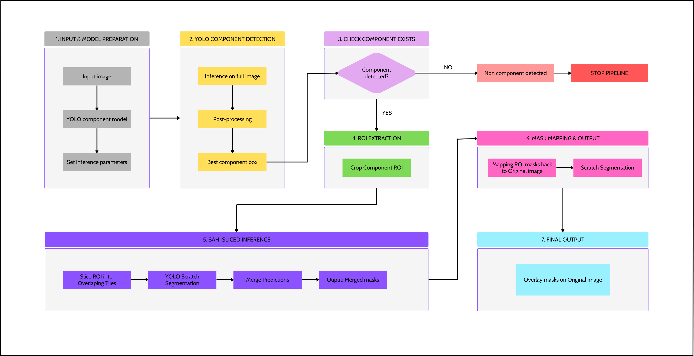
</p>

1. Load a high-resolution surface image from `data/raw/`.
2. Run the YOLO component detector to locate the main part ROI.
3. Crop the component ROI instead of resizing the full image directly.
4. Run SAHI sliced inference on the ROI with the YOLO scratch segmenter.
5. Merge the sliced predictions into one scratch mask.
6. Paste the ROI mask back to the original image size.
7. Review the result in the PySide6 GUI or send it to the Annotation tab for correction.

## Training Workflow

<p align="center">
  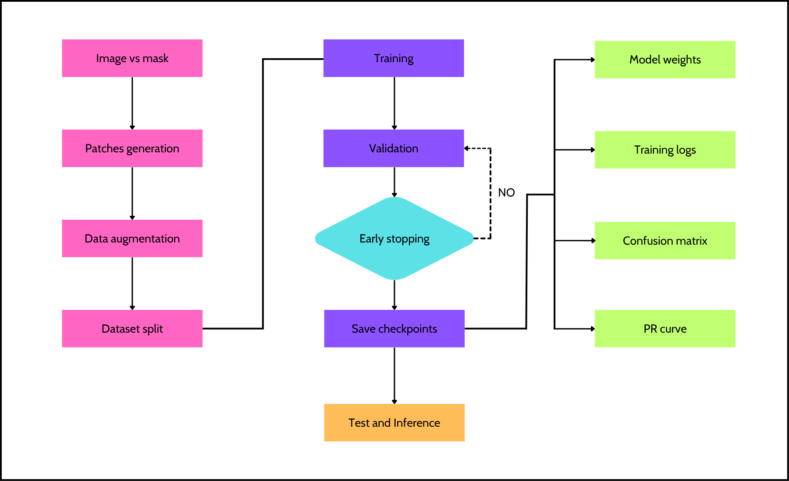
</p>

1. Collect raw images.
2. Label scratches with SAM2-assisted point or box prompts.
3. Save reviewed image-mask pairs to `outputs/labeling/`.
4. Convert labels directly into YOLO instance-segmentation format.
5. Train a YOLO26 scratch segmentation model.
6. Evaluate metrics and inspect plots.
7. Use model predictions as draft labels for the next data iteration.

## SAHI Inference

<p align="center">
  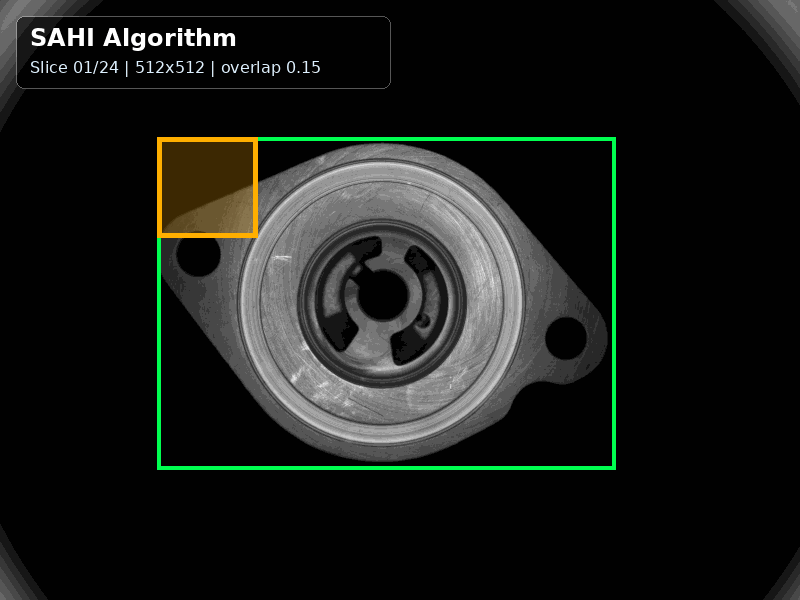
</p>

SAHI stands for Slicing Aided Hyper Inference. In this project, SAHI is not run
on the full image blindly. It is guided by the component detector:

```text
full image -> component YOLO -> ROI crop -> SAHI slices -> scratch YOLO -> full-size mask
```

This keeps the inference area smaller while still avoiding full-image downscaling,
which can blur thin scratches.

## Prediction Examples

<p align="center">
  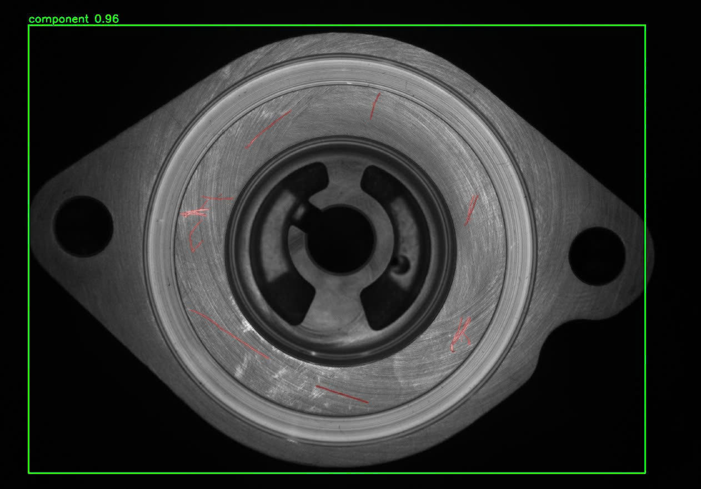
</p>

<p align="center">
  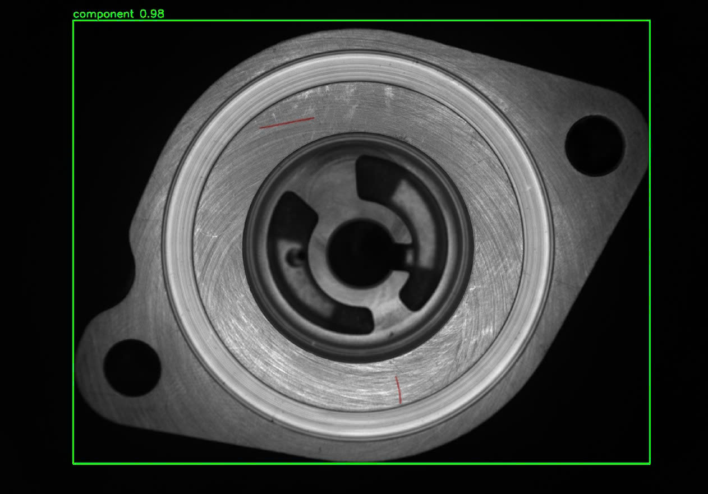
</p>

## SAM2-Assisted Annotation

SAM2 is used as an interactive labeling assistant. The user can prompt the model
with points or boxes, accept the proposed mask, correct it manually, and save the
final label for future YOLO training.

### Point Prompt

<p align="center">
  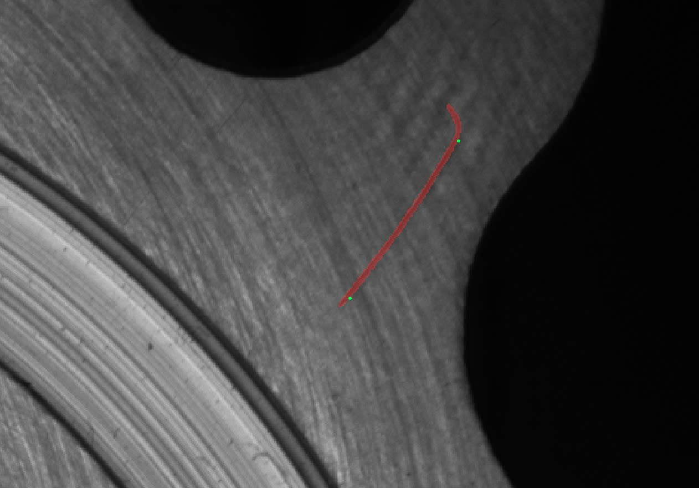
  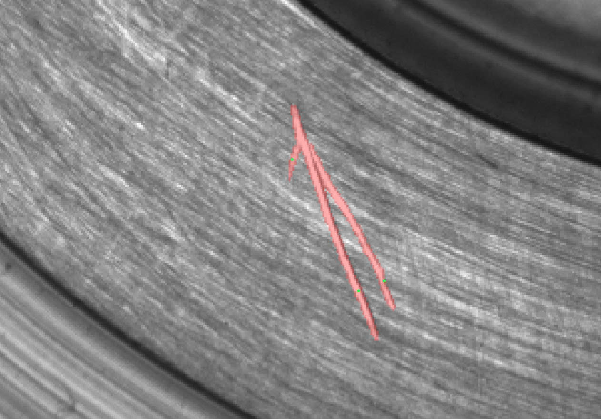
  
  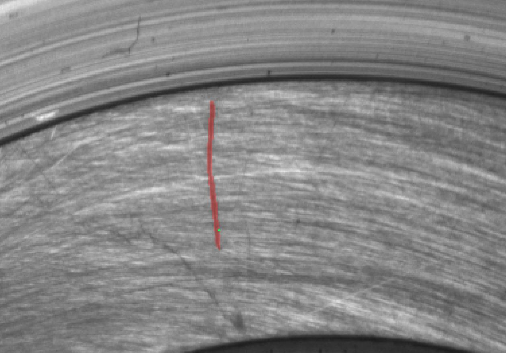
</p>

### Box Prompt

<p align="center">
  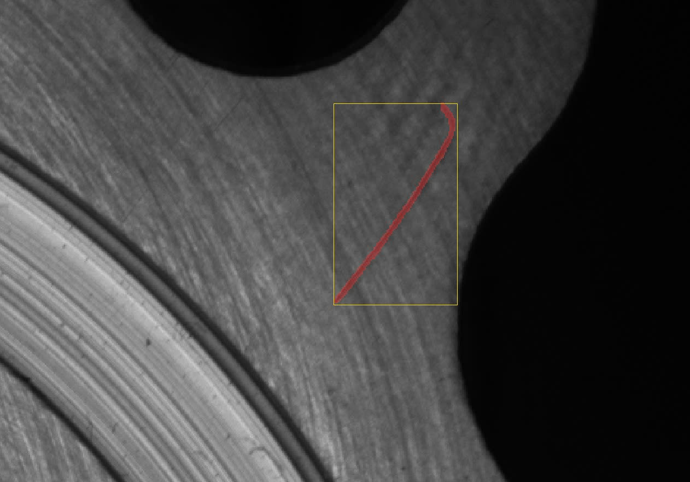
  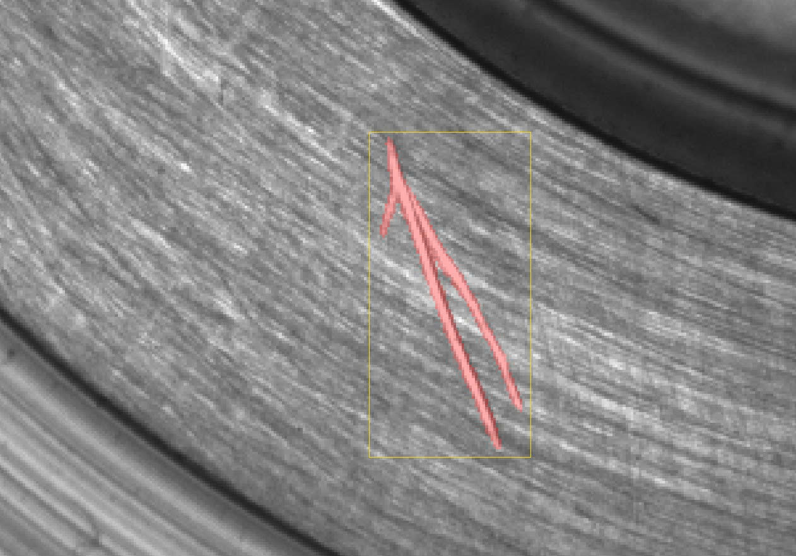
  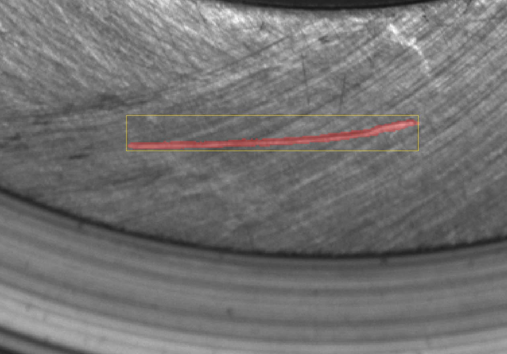
  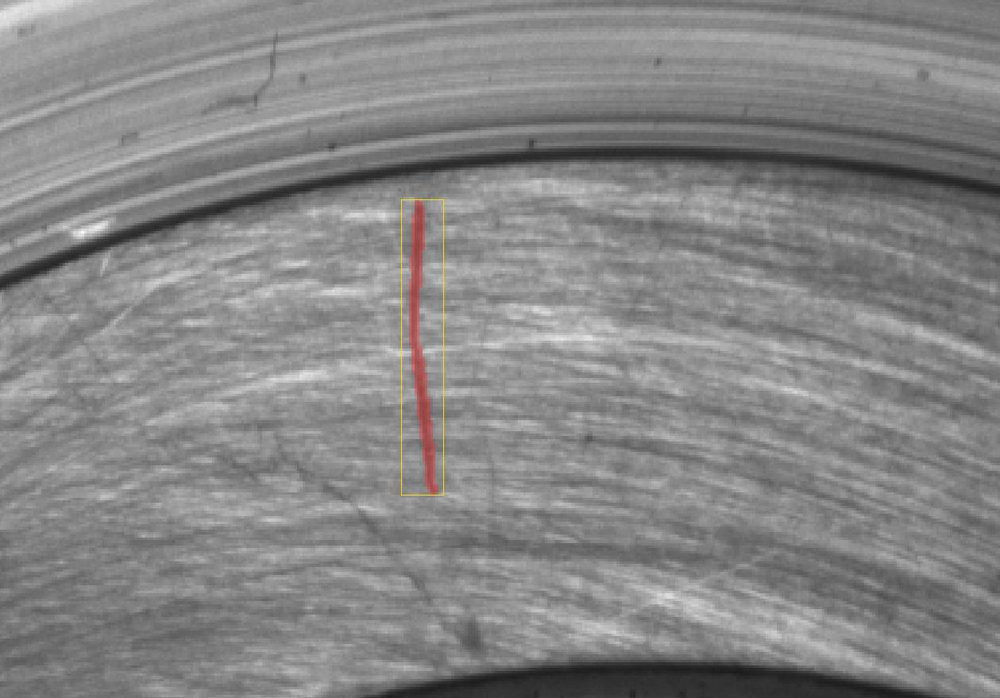
</p>

## Model Roles

| Model | Task | Purpose |
|---|---|---|
| YOLO component detector | Object detection | Find the component bounding-box ROI |
| YOLO scratch segmenter | Instance segmentation | Segment scratch masks inside the ROI |
| SAHI | Sliced inference | Split the ROI into slices and merge predictions |
| SAM2 | Prompt-based segmentation | Assist labeling and mask refinement |

## User Interface

The desktop GUI is implemented with PySide6:

```bash
.venv/bin/python -m src.gui.main
```

| Tab | Purpose |
|---|---|
| `Inference` | Run component-guided SAHI scratch inference and review predictions |
| `Training` | Train scratch YOLO26 segmentation from the GUI |
| `Data Processing` | Prepare YOLO datasets from labeled image-mask pairs |
| `Annotation` | Label or refine scratches with SAM2, brush, eraser, point, and box tools |
| `Camera` | Camera and image acquisition utilities |

The Inference tab can send a predicted mask directly to the Annotation tab. This
allows a worker to correct the prediction and save it as a new training label.

## Project Structure

```text
Surface-Scratch-Detection/
├── assets/                    # README images and visual examples
├── configs/
│   ├── data.py                # Dataset splits, image extensions, mask settings
│   ├── path.py                # Shared project paths
│   └── yolo.py                # Component and scratch YOLO defaults
├── data/
│   ├── raw/                   # Original high-resolution images
│   ├── component/             # YOLO component detection dataset
│   ├── scratch_yolo_seg/      # YOLO scratch segmentation dataset
│   └── scratch_sam2_format/   # SAM2 fine-tuning dataset
├── models/
│   ├── yolo/
│   │   ├── component/         # Component detector checkpoint
│   │   ├── scratch_yolo26n_seg/
│   │   └── scratch_yolo26s_seg/
│   └── sam2/                  # SAM2 checkpoints
├── notebooks/
│   ├── train_yolo.ipynb       # Google Colab YOLO training workflow
│   └── train_sam2.ipynb       # Google Colab SAM2 fine-tuning workflow
├── outputs/
│   ├── labeling/              # Reviewed images and masks
│   ├── metrics/               # Evaluation reports and plots
│   └── yolo/                  # Inference outputs
├── src/
│   ├── dataset/               # End-to-end dataset preparation scripts
│   ├── evaluation/            # YOLO and SAM2 evaluation scripts
│   ├── gui/                   # Main PySide6 application
│   ├── openvino/              # Optional YOLO OpenVINO export and benchmark
│   ├── processing/            # Legacy/experimental processing helpers
│   └── yolo/
│       ├── component/         # Component detector training and inference
│       └── scratch/           # Scratch segmentation training and inference
├── .dockerignore
├── Dockerfile
├── docker-compose.yml
├── requirements.txt
└── README.md
```

`data/`, `models/`, and `outputs/` are runtime artifacts. They are intentionally
kept outside Git because they can be large and machine-specific.

## Prerequisites

- Python 3.12
- pip
- Docker and Docker Compose, optional
- CUDA-capable GPU, optional for training acceleration
- Linux X11 display, required for Docker GUI mode

## Installation

Create and activate a virtual environment:

```bash
python3 -m venv .venv
source .venv/bin/activate
python -m pip install --upgrade pip
python -m pip install -r requirements.txt
```

## Model Checkpoints

Default model paths are configured in `configs/yolo.py`:

```text
models/
├── yolo/
│   ├── component/
│   │   └── weights/
│   │       └── best.pt
│   ├── scratch_yolo26n_seg/
│   │   └── weights/
│   │       └── best.pt
│   └── scratch_yolo26s_seg/
│       └── weights/
│           └── best.pt
└── sam2/
    └── checkpoint.pt
```

A fresh clone does not include datasets or checkpoints. Restore or mount
`data/`, `models/`, and `outputs/` before running full inference.

## Run the GUI

```bash
source .venv/bin/activate
.venv/bin/python -m src.gui.main
```

Run only the SAHI inference tab for quick testing:

```bash
.venv/bin/python -m src.gui.sahi
```

## Run With Docker

The Docker image contains code and dependencies. Datasets, checkpoints, and
outputs are mounted from the host:

```text
./data    -> /app/data
./models  -> /app/models
./outputs -> /app/outputs
```

Allow Docker containers to use the host X11 display:

```bash
xhost +local:docker
```

Build and run the GUI:

```bash
docker compose up --build surface-scratch-gui
```

Run a CLI command inside the same image:

```bash
docker compose --profile cli run --rm surface-scratch-cli
```

## Dataset Preparation

### Labeling Output

The Annotation tab writes reviewed samples to:

```text
outputs/labeling/
  images/
  masks/
```

### YOLO Scratch Segmentation Dataset

Prepare a YOLO instance-segmentation dataset directly from labeled masks:

```bash
.venv/bin/python -m src.dataset.prepare_yolo_dataset \
  --src outputs/labeling \
  --output-root data/scratch_yolo_seg \
  --train-ratio 0.70 \
  --valid-ratio 0.20 \
  --test-ratio 0.10 \
  --patch-size 512 \
  --overlap 0.25 \
  --train-negative-ratio 1.0 \
  --valid-negative-ratio 1.5 \
  --test-negative-ratio 1.5 \
  --seed 42 \
  --overwrite
```

Output:

```text
data/scratch_yolo_seg/
  train/images/
  train/labels/
  valid/images/
  valid/labels/
  test/images/
  test/labels/
  data.yaml
```

Optional: also export full-size train/valid/test image-mask splits for
evaluation:

```bash
.venv/bin/python -m src.dataset.prepare_yolo_dataset \
  --src outputs/labeling \
  --output-root data/scratch_yolo_seg \
  --split-output-root data/scratch \
  --overwrite
```

### SAM2 Fine-tuning Dataset

Prepare the one-frame SAM2 dataset format:

```bash
.venv/bin/python -m src.dataset.prepare_sam2_dataset \
  --src outputs/labeling \
  --dst data/scratch_sam2_format \
  --train-ratio 0.70 \
  --valid-ratio 0.20 \
  --test-ratio 0.10 \
  --patch-size 1024 \
  --overlap 0.25 \
  --seed 42 \
  --overwrite
```

Output:

```text
data/scratch_sam2_format/
  JPEGImages/<split>/<sample_id>/00000.png
  Annotations/<split>/<sample_id>/00000.png
  ImageSets/train.txt
  ImageSets/valid.txt
  ImageSets/test.txt
```

## Training

### Scratch YOLO26 Segmentation

Train from the CLI:

```bash
.venv/bin/python -m src.yolo.scratch.train \
  --data data/scratch_yolo_seg/data.yaml \
  --model yolo26n-seg.pt \
  --imgsz 512 \
  --batch 16 \
  --epochs 100 \
  --patience 30 \
  --lr 0.002 \
  --device auto \
  --project models/yolo \
  --name scratch_yolo26n_seg
```

Common base models:

```text
yolo26n-seg.pt
yolo26s-seg.pt
yolo26m-seg.pt
yolo26l-seg.pt
yolo26x-seg.pt
```

Use `n` for speed-sensitive local inference. Use larger models only when the
quality gain is worth the slower runtime.

### Component YOLO Detection

Train the component detector:

```bash
.venv/bin/python -m src.yolo.component.train \
  --data data/component/data.yaml \
  --model yolo26n.pt \
  --imgsz 640 \
  --batch 8 \
  --epochs 100
```

### Notebook Training

Google Colab workflows are provided for longer training runs:

```text
notebooks/train_yolo.ipynb
notebooks/train_sam2.ipynb
```

The notebooks are designed for Drive upload, Colab training, training-history
logging, checkpoint saving, and copying model artifacts back to Drive.

## Evaluation

### YOLO Scratch Segmentation

```bash
.venv/bin/python -m src.evaluation.yolo_scratch \
  --data data/scratch \
  --split test \
  --model models/yolo/scratch_yolo26n_seg/weights/best.pt
```

Outputs are saved under:

```text
outputs/metrics/yolo_scratch/
```

Typical outputs include:

- `summary.json`
- metric bar plots
- confidence-threshold curves
- confusion matrix plots
- prediction visualizations

### YOLO Component Detection

```bash
.venv/bin/python -m src.evaluation.yolo_component \
  --data data/component/data.yaml \
  --split val \
  --model models/yolo/component/weights/best.pt
```

Outputs are saved under:

```text
outputs/metrics/yolo_component/
```

### SAM2 Prompt Evaluation

```bash
.venv/bin/python -m src.evaluation.sam2 \
  --data data/scratch_sam2_format \
  --split test
```

Outputs are saved under:

```text
outputs/metrics/sam2/
```

## Inference

### GUI SAHI Inference

The main inference path is the PySide6 GUI:

```bash
.venv/bin/python -m src.gui.main
```

The active Inference tab uses:

```text
component YOLO -> ROI crop -> SAHI sliced scratch YOLO -> full-size mask/overlay
```

### Component Detection CLI

```bash
.venv/bin/python -m src.yolo.component.inference \
  --source data/raw \
  --model models/yolo/component/weights/best.pt \
  --output-dir outputs/yolo/component
```

### Scratch Segmentation CLI

The scratch CLI is kept for standalone experiments:

```bash
.venv/bin/python -m src.yolo.scratch.inference \
  --source data/raw \
  --model models/yolo/scratch_yolo26n_seg/weights/best.pt \
  --mode sliding \
  --tile-size 512 \
  --overlap 0.15 \
  --imgsz 512 \
  --conf 0.10 \
  --output-dir outputs/yolo/scratch
```

The production-facing GUI path uses SAHI through `src/gui/sahi.py`.

## Export and Runtime Optimization

### OpenVINO

OpenVINO export is available for CPU deployment experiments:

```bash
.venv/bin/python -m src.openvino.yolo_export \
  --model models/yolo/scratch_yolo26n_seg/weights/best.pt \
  --imgsz 512
```

Benchmark PyTorch and OpenVINO:

```bash
.venv/bin/python -m src.openvino.evaluation \
  --image-dir data/scratch_yolo_seg/test/images \
  --max-images 10 \
  --repeat 3
```

## Configuration

| File | Purpose |
|---|---|
| `configs/path.py` | Project root, `data/`, `models/`, `outputs/`, metrics, and labeling paths |
| `configs/data.py` | Split names, image extensions, binary masks, and labeling paths |
| `configs/yolo.py` | Component and scratch YOLO datasets, checkpoints, thresholds, and training defaults |

## Important Paths

| Path | Description |
|---|---|
| `data/raw/` | Original camera/raw images |
| `outputs/labeling/images/` | Reviewed source images |
| `outputs/labeling/masks/` | Reviewed binary masks |
| `data/scratch_yolo_seg/` | YOLO scratch segmentation dataset |
| `data/scratch_sam2_format/` | SAM2 fine-tuning dataset |
| `models/yolo/` | YOLO checkpoints |
| `models/sam2/` | SAM2 checkpoints |
| `outputs/yolo/` | Inference outputs |
| `outputs/metrics/` | Evaluation outputs |

## Git and Artifact Policy

The repository should track source code, configs, notebooks, Docker files, and
documentation. Large runtime artifacts are ignored:

```text
data/
models/
outputs/
.venv/
*.pt
*.pth
*.onnx
*.xml
*.bin
*.engine
```

To reproduce a full local run from a fresh clone, restore the required `data/`
and `models/` folders separately.

## Tech Stack

- Python 3.12
- PySide6
- Ultralytics YOLO26
- SAHI
- SAM2
- PyTorch
- Torchvision
- OpenCV
- NumPy
- Albumentations
- Matplotlib
- OpenVINO, optional runtime experiment
- Docker / Docker Compose
